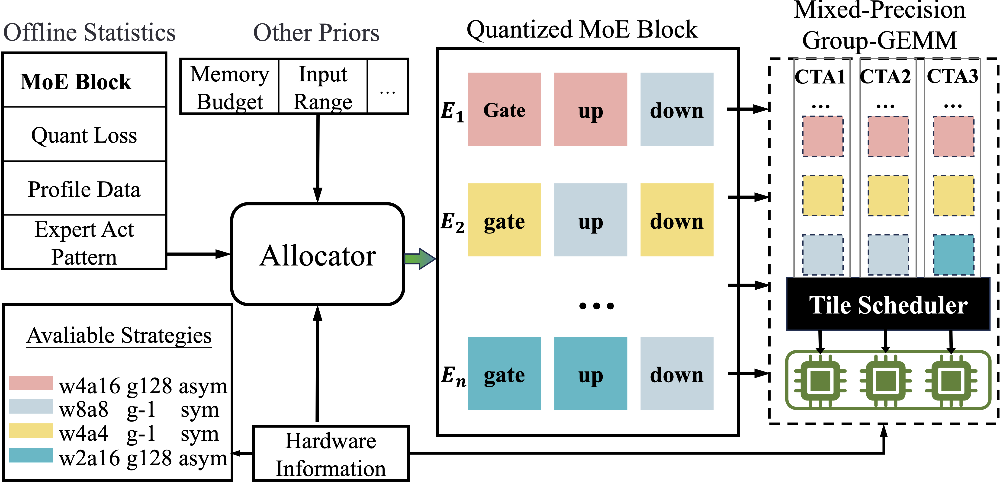
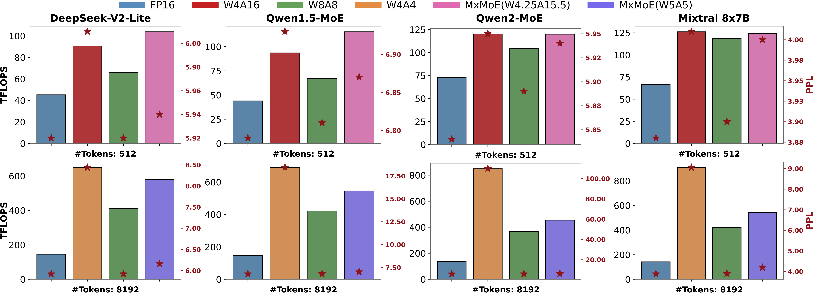

# MxMoE: Mixed-precision Quantization for MoE with Accuracy and Performance Co-Design
<div align="center">

[](https://arxiv.org/abs/2505.05799)&nbsp;


[Haojie Duanmu](https://cat538.github.io/)<sup>1,2</sup> | [Xiuhong Li](https://scholar.google.com/citations?user=90eREm0AAAAJ&hl=en)<sup>3</sup> | [Zhihang Yuan](https://zhihang.cc/)<sup>3</sup> | [Size Zheng](https://sizezheng.github.io/)<sup>4</sup> | [Jiangfei Duan](https://jf-d.github.io/)<sup>5</sup><br> Xingcheng Zhang<sup>2</sup> | Dahua Lin<sup>2,5</sup>

<sup>1</sup>SJTU, <sup>2</sup>Shanghai AI Laboratory, <sup>3</sup>PKU, <sup>4</sup>Bytedance Seed, <sup>5</sup>CUHK.
</div>


## 🙈 TL;DR
> Can we design a quantization scheme specifically tailored to MoE models that effectively balancing model accuracy and computational efficiency?

**Insight**:

- Linear-block level: Linear blocks exhibit varying quantization sensitivity
- Expert level: Imbalanced activation frequencies $\Rightarrow$ heterogeneous computational characteristics (e.g. some experts are compute-bound while some are memory-bound).

**Approach**:

We explore the automated design of mixed-precision quantization scheme for MoE models:

1. Assign bitwidth at linear-block level.
2. Optimize bitwidth allocation (which is formulated as an ILP) by taking both model accuracy (quantization loss estimation) and computational efficiency (performance model) into consideration.
3. Generate mixed-precision GroupGEMM operator through template-based kernel generation.




## 🚀 Results



## 🛠️ Usage

1. Pre-requirement

    ```bash
    # 0. virtual env
    conda create -n mxmoe python=3.12 -y

    # 1. source code dependencies
    git submodule update --init --recursive

    # 2. python package dependencies
    pip install -r requirements.txt
    cd mxmoe/3rdparty/fast-hadamard-transform && pip install . && cd -
    ```

2. View the activation statistic of MoE models:

    ```bash
    # e.g. sample data from humaneval-x to observe qwen2_moe (in fact qwen1.5moe)
    CUDA_VISIBLE_DEVICES=6 python -m mxmoe.quant.moe_tracer --model qwen2_moe --trace_gate --dataset humaneval-x
    ```

3. Calibration

    1. Get the quant loss of each linear-blocks of `<MOE_MODEL>` (e.g. `qwen2_moe`) under certain `<QUANTIZATION_CONFIG>` (e.g. `w4a4_g-1_sym`):

        ```bash
        CUDA_VISIBLE_DEVICES=6 python -m mxmoe.quant.quant calib --model qwen2_moe --method rtn --metric layer_out_norm --qcfg w8a8_g-1_sym
        ```
    2. Solve the ILP based on the quant loss and kernel profile. Quantization scheme will be saved in `qconfigs`

        ```bash
        # e.g. re-produce mxmoe w5a5
        python -m mxmoe.quant.bits_solver --model qwen2_moe --qtype gptq-had --wbits 5.0 --solve_mode layer --batch 8192 --filter_list w4a4_g-1_sym w8a8_g-1_sym
        ```
    
4. Accuracy Eval. You can re-produce the exp in paper by setting corresponding tasks and quantization configs.

    ```bash
    # e.g. evaluate the performance of qwen1.5_moe under RTN w4a4_g-1_sym quantization config
    CUDA_VISIBLE_DEVICES=6 python -m mxmoe.quant.quant eval --model qwen2_moe --method rtn-had --qstr w4a4_g-1_sym --tasks ppl
    ```

5. Performance (Computational Efficiency) Eval. After we get the mixed-precision scheme (Step 3), we can automatially generate corresponding GroupGEMM kernel.

    please refer to [run_mxmoe_gg.py](./run_mxmoe_gg.py).

    ```bash
    # e.g. test groupgemm in the layer-11 of qwen2_moe model (FP16):
    PYTHONPATH=/home/teai/gwf_file/MxMoE:$PYTHONPATH
    python run_mxmoe_gg.py --model qwen2_moe --bs 8192 --layer 11
    
    # e.g. test groupgemm in the layer-11 of qwen2_moe model under mixed-precision
    python run_mxmoe_gg.py --model qwen2_moe --bs 8192 --layer 11 --qconfig /home/teai/gwf_file/MxMoE/qconfigs/w4a4_g-1_sym+w8a8_g-1_sym/qwen2_moe_rtn_Slayer_bs8192_wbits5.0_r0.0.json --tile_config /home/teai/gwf_file/MxMoE/qconfigs/w4a4_g-1_sym+w8a8_g-1_sym/qwen2_moe_rtn_Slayer_bs8192_wbits5.0_r0.0_tile_cfg.json
    ```

## 👀 Limitations

⚠️ MxMoE is mainly test on RTX-4090. The current implementation cannot fully utilize the performance of hopper and later GPU architectures.

⚠️ The profile step is a little bit time consuming. We expect to upload our previously calculated quant loss statistics and kernel profile data soon, allowing you to skip this step.


## 😺 Citation
If you find MxMoE useful or relevant to your project and research, please kindly cite our paper:

```latex
@article{duanmu2025mxmoe,
  title={MxMoE: Mixed-precision Quantization for MoE with Accuracy and Performance Co-Design},
  author={Duanmu, Haojie and Li, Xiuhong and Yuan, Zhihang and Zheng, Size and Duan, Jiangfei and Zhang, Xingcheng and Lin, Dahua},
  journal={arXiv preprint arXiv:2505.05799},
  year={2025}
}
```